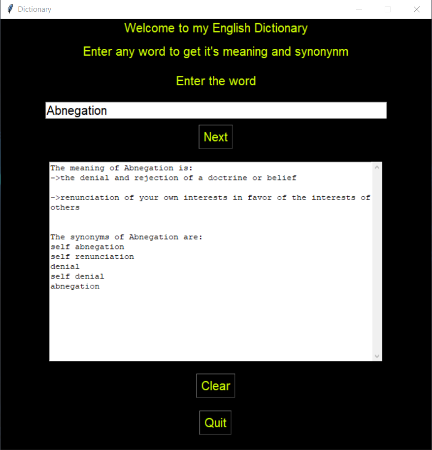

# Dictionary-GUI
- An English dictionary built using Python that gives the meaning of the word and its synonynm.
- It uses the following libraries: 

`nltk` a Python package for natural language processing

# Installation
- To run this application, you need to have Python 3.x installed on your system. You can download Python from the official website: https://www.python.org/downloads/.

- Once you have Python installed, you need to install the required modules using pip. Open a command prompt or terminal window and run the following command:

 pip install `-r requirements.txt`

- This will install the packages.

# Using the Program/Working
- To run the application, open a command prompt or terminal window and navigate to the directory where the Dictionary.py file is located. Then run the following command:

python Dictionary.py

-After running the program, enter the your word on the entry box to check its meaning and press "Next".

-The meaning of the word enterd along with its synonyms will be displayed on the textbox.

-Use the "Clear" button to clear the output and the "Quit" button to exit from the window.

# Screenshots

# Follow me and Star ⭐ my Repository

# Thank You!
